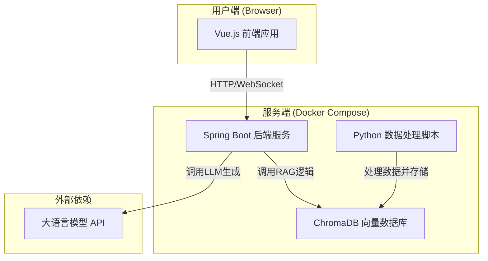

# 项目蓝图：AI驱动的《饥荒》世界知识探索平台

## 1. 项目定位 (Elevator Pitch)

**一句话总结：** 这是一个基于大语言模型（LLM）与检索增强生成（RAG）技术，为《饥荒》游戏玩家打造的智能问答与知识探索平台。项目采用现代化的前后端分离架构（Vue 3 + Spring Boot），旨在提供比传统Wiki更高效、更智能的信息获取体验。

**简历亮点：**
- **技术栈先进：** 熟练运用业界主流的 Spring Boot 和 Vue 3 构建全栈应用。
- **AI工程化：** 具备从数据处理、向量化、混合检索到服务部署的端到端AI应用落地能力。
- **系统设计能力：** 能够设计并实现一个包含数据层、服务层、表现层的复杂、高内聚、低耦合的系统。

---

## 2. 核心功能模块 (Resume Highlights)

### 后端 (Java & Spring Boot)

- **`[核心]` 混合检索RAG引擎 API**
  - **描述:** 基于 Spring Boot 构建，封装了整个RAG检索逻辑。通过RESTful API向前端提供智能问答服务。
  - **技术细节:**
    - **混合检索:** 结合**向量检索** (ChromaDB) 与**关键字检索** (BM25)，确保结果的广度与精度。
    - **异步处理:** 对于复杂的查询，采用 `CompletableFuture` 进行异步处理，优化响应时间。
    - **API设计:** 提供 `/api/v1/qa/ask` (流式/非流式问答) 和 `/api/v1/kb/search` (知识库搜索) 等核心接口。
- **`[亮点]` 可靠的数据管道与管理**
  - **描述:** 设计并实现了一套健壮的数据处理与加载流程。
  - **技术细节:**
    - **数据预处理:** Python脚本负责抓取、清洗、并标准化Markdown知识文件。
    - **数据加载API:** Spring Boot提供 `/api/v1/admin/kb/load` 接口，用于触发知识库的增量加载与索引重建，并通过`@Async`注解实现后台执行，不阻塞主服务。
    - **数据校验:** 在数据入库前进行严格的格式与内容校验。
- **`[加分]` WebSocket实时通信**
  - **描述:** 为问答接口提供WebSocket支持，实现LLM回答的“打字机”流式效果，极大提升用户体验。
  - **技术细节:**
    - **Spring WebSocket:** 使用`spring-boot-starter-websocket`模块，通过STOMP协议或原生WebSocket实现服务端消息推送。
- **`[基础]` 容器化部署**
  - **描述:** 整个后端服务（Spring Boot应用、ChromaDB、Python脚本环境）通过 Docker 和 Docker Compose 进行容器化编排，实现一键部署与环境隔离。

### 前端 (Vue.js)

- **`[核心]` 现代化智能问答UI**
  - **描述:** 一个美观、响应式的对话界面，用户可以在此与AI进行流畅的交互。
  - **技术细节:**
    - **Vue 3 Composition API:** 全面使用组合式API，提升代码的可读性与可维护性。
    - **实时消息流:** 对接后端WebSocket，实时渲染AI的流式回答。
    - **Markdown渲染:** 使用 `marked.js` 或类似库，将返回的Markdown格式答案完美渲染成HTML，支持表格、代码块、列表等。
- **`[亮点]` 可视化知识库浏览器**
  - **描述:** 除了问答，还提供一个让用户可以直观探索整个知识库的界面。
  - **技术细节:**
    - **树状组件:** 根据我们之前努力修正的`category`元数据，将知识库以树状结构（如：`Bosses > Spider Queen`）展示。
    - **动态路由:** 使用 `Vue Router`，点击知识树节点可跳转到对应知识的详情页面。
    - **状态管理:** 使用 `Pinia` 跨组件管理知识库的分类、用户登录状态等全局数据。
- **`[基础]` 工程化与组件化**
  - **描述:** 项目遵循模块化、组件化的开发思想，代码结构清晰。
  - **技术细节:**
    - **Vite:** 使用下一代构建工具Vite，提供极速的开发服务器启动与热更新。
    - **Element Plus/Ant Design Vue:** 采用成熟的UI组件库，保证UI的质量与开发效率。

---

## 3. 系统架构图

---

## 4. 技术栈关键词 (Resume Keywords)

- **后端:** `Java`, `Spring Boot`, `Spring MVC`, `Spring Data JPA`, `WebSocket`, `Maven/Gradle`, `RESTful API`, `Lombok`, `Docker`, `Docker Compose`
- **前端:** `Vue 3`, `Vite`, `Vue Router`, `Pinia`, `TypeScript`, `Axios`, `Element Plus`, `HTML5`, `CSS3`, `JavaScript (ES6+)`
- **AI / 数据:** `Python`, `RAG (Retrieval-Augmented Generation)`, `Vector Database (ChromaDB)`, `Hybrid Search (Vector + BM25)`, `Sentence-Transformers`, `Markdown`

---

## 5. 项目的下一步 (Future Vision)

- **用户反馈与优化:** 增加对回答的“赞/踩”功能，收集数据用于未来对RAG流程的 fine-tuning。
- **多模态支持:** 不仅支持文本问答，未来可扩展支持图片、声音等知识的检索。
- **国际化:** 利用您的语言优势，增加对日语/英语知识库的支持与界面切换功能。 